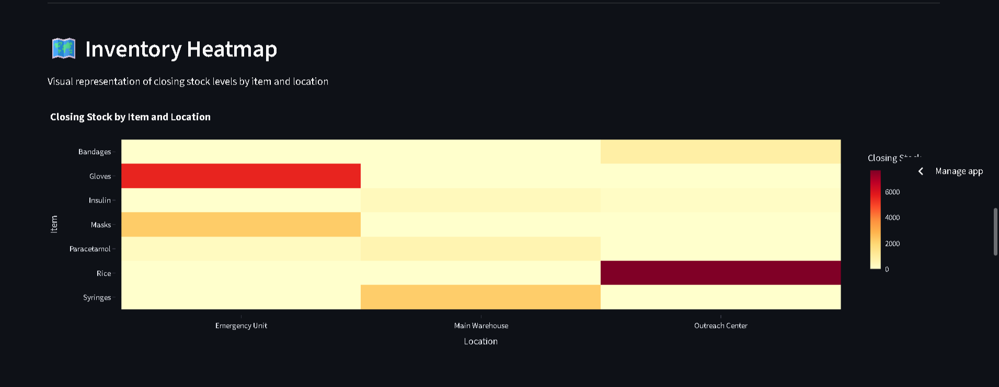
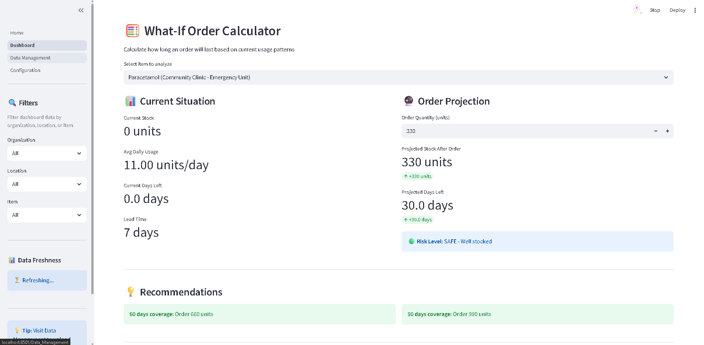
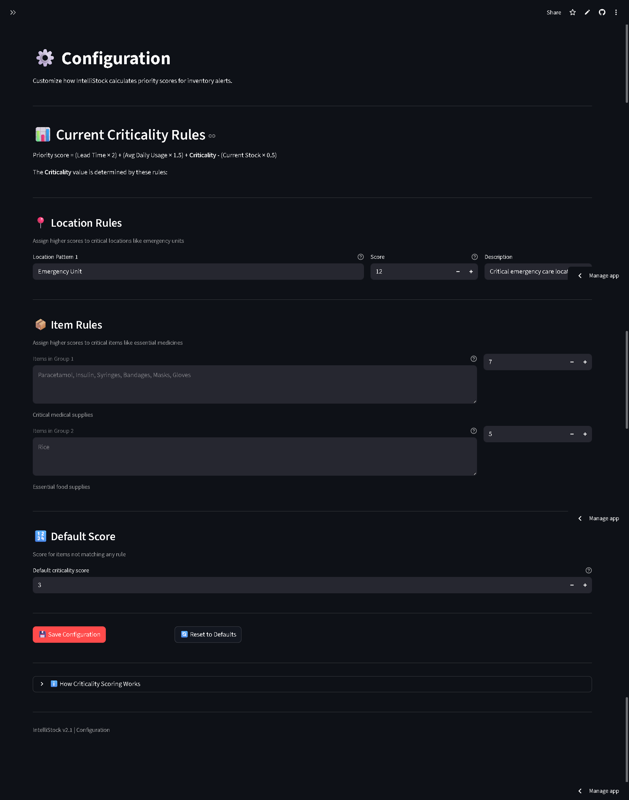

# 📦 IntelliStock - AI-Driven Inventory Health System

> **Hackathon Submission:** Snowflake AI for Good Hackathon 2025  
> **Problem Statement:** Inventory Management for Essential Goods  
> **Status:** 100% Requirements Compliance ✅  
> **Live Demo:** [https://intellistock-ai-dashbaord-mvp.streamlit.app/](https://intellistock-ai-dashbaord-mvp.streamlit.app/)


## 🎯 Problem Statement

Hospitals, public distribution systems, and NGOs struggle to keep medicines, food, and other essentials available in the right place at the right time. Data on sales/usage, inventory, and purchase orders often lives in separate systems, so teams spot stock issues only when shelves are already empty or over-full.

**The Goal:** Build a single view of stock health that:

- Shows a heatmap by location and item
- Warns early about items likely to run out within a few days
- Suggests sensible reorder quantities or priority lists
- Provides easy exports that procurement or field teams can act on

**Why AI for Good?** This solution helps reduce waste and avoid stock-outs of critical supplies, ensuring essential medicines and food reach those who need them most.

---

## ✨ Solution Overview

IntelliStock is an intelligent inventory management system that leverages **Snowflake's native features** to provide real-time stock-out predictions, automated analytics, and data-driven decision support for essential goods organizations.

### Key Features

🎯 **Smart Prioritization**

- Priority-ranked action panel showing top 3 items requiring immediate attention
- AI-driven risk scoring based on lead time, usage patterns, and criticality
- Real-time alerts for items likely to run out within days

📊 **Visual Analytics**

- Interactive heatmaps showing stock levels by location and item
- 7-day trend visualization with sparkline charts
- Multi-dimensional filtering (organization, location, item)

🧮 **Decision Support Tools**

- What-If Order Calculator to project inventory coverage
- Automated reorder quantity recommendations
- PDF export for offline sharing with procurement teams

⚙️ **Snowflake Native Features** (100% Compliance)

- **Dynamic Tables**: Auto-refreshing analytics (3 tables)
- **Streams & Tasks**: Event-driven processing and scheduling
- **Streamlit**: Interactive dashboard and UI
- **Unistore**: Action logging with ACID guarantees (optional feature)
- **Snowpark SQL**: Advanced calculations and stored procedures

---

## 🏗️ Architecture & Tech Stack

### Snowflake Features Used

| Feature            | Implementation                                                                     | Purpose                                                                      |
| ------------------ | ---------------------------------------------------------------------------------- | ---------------------------------------------------------------------------- |
| **Dynamic Tables** | `STOCK_ANALYTICS_DT`<br>`REORDER_RECOMMENDATIONS_DT`<br>`DAILY_USAGE_STATS_DT`     | Auto-refresh calculations every 5-15 minutes when source data changes        |
| **Streams**        | `INVENTORY_CHANGES`<br>`ANALYTICS_CHANGES`                                         | Change data capture for event-driven processing                              |
| **Tasks**          | `TASK_REFRESH_ANALYTICS_SUMMARY`<br>`TASK_GENERATE_ALERTS`<br>`TASK_DAILY_CLEANUP` | Scheduled automation (15-minute refresh, daily cleanup at 2 AM)              |
| **Streamlit**      | Multi-page dashboard app                                                           | User-friendly interface with Home, Dashboard, Data Management, Configuration |
| **Unistore**       | `ACTION_LOG`<br>`USER_SESSION_LOG`<br>`ORDER_TRACKING`                             | High-performance transactional logging with row-level locking                |
| **Snowpark SQL**   | Stored procedures and analytics                                                    | Complex calculations and business logic                                      |

### Application Stack

- **Frontend**: Streamlit (Python)
- **Backend**: Snowflake (Data Warehouse + Compute)
- **Analytics**: Pandas, Plotly
- **Reporting**: ReportLab (PDF generation)
- **Configuration**: Python-dotenv

---

## 📸 Screenshots

### Dashboard - Overview & Heatmap

Real-time inventory metrics with visual heatmap showing closing stock by item and location.



### What-If Order Calculator

Project how many days of stock an order will provide based on current usage patterns.



### Data Management

Upload and validate inventory CSV files with comprehensive schema validation.


### Configuration

Customize criticality scoring rules for locations and items.



---

## 🚀 Quick Start

### Prerequisites

- Python 3.8 or higher
- Snowflake account with credentials
- Git (for cloning the repository)

### Installation

1. **Clone the repository:**

```bash
git clone https://github.com/udaykumar0515/intellistock-ai-for-good.git
cd intellistock-ai-for-good
```

2. **Create and activate virtual environment:**

```bash
# Create venv
python -m venv venv

# Activate (Windows)
venv\Scripts\activate

# Activate (macOS/Linux)
source venv/bin/activate
```

3. **Install dependencies:**

```bash
pip install -r requirements.txt
```

4. **Configure Snowflake credentials:**

Create a `.env` file in the project root (copy from `.env.example`):

```env
SNOWFLAKE_ACCOUNT=your_account
SNOWFLAKE_USER=your_username
SNOWFLAKE_PASSWORD=your_password
SNOWFLAKE_DATABASE=INTELLISTOCK_DB
SNOWFLAKE_SCHEMA=PUBLIC
SNOWFLAKE_WAREHOUSE=COMPUTE_WH
```

**Note:** Never commit the `.env` file to version control.

5. **Initialize Snowflake database:**

Navigate to the Data Management page in the app and click:

- **Test Connection** (verify credentials)
- **Initialize Database** (create tables)
- **Load Sample Data** (optional, for testing)

### Running the Application

**Option 1: Using batch file (Windows)**

```bash
run.bat
```

**Option 2: Manual command**

```bash
streamlit run Home.py
```

The app will automatically open in your browser at `http://localhost:8501`

---

## 📁 Project Structure

```
intellistock-ai-for-good/
├── Home.py                          # Landing page with navigation
├── pages/
│   ├── 1__Dashboard.py              # Main analytics dashboard
│   ├── 2__Data_Management.py        # CSV upload & database tools
│   └── 3__Configuration.py          # Criticality scoring editor
├── utils/
│   ├── calculations.py              # Business logic helpers
│   └── csv_validator.py             # Data validation logic
├── sql/
│   ├── create_tables.sql            # Base schema
│   ├── create_dynamic_tables.sql    # Dynamic Tables (3 tables)
│   ├── create_streams_tasks.sql     # Streams & Tasks setup
│   └── create_unistore_tables.sql   # Unistore hybrid tables
├── data/
│   └── inventory_sample.csv         # Sample dataset (30+ days, 3 orgs, 7 items)
├── screenshots/                     # Application screenshots
├── snowflake_connector.py           # Database connection handler
├── snowflake_tasks_helper.py        # Task management utilities
├── criticality_config.json          # Scoring rules configuration
├── requirements.txt                 # Python dependencies
├── .env.example                     # Environment template
└── README.md                        # This file
```

---

## 📊 Data Schema

### Required CSV Format

Your inventory CSV file must include these 9 columns:

| Column           | Type    | Description            | Example        |
| ---------------- | ------- | ---------------------- | -------------- |
| `date`           | DATE    | Transaction date       | 2025-01-15     |
| `organization`   | STRING  | Organization name      | City Hospital  |
| `location`       | STRING  | Warehouse/facility     | Emergency Unit |
| `item`           | STRING  | Product name           | Paracetamol    |
| `opening_stock`  | INTEGER | Stock at start of day  | 100            |
| `received`       | INTEGER | Units received         | 50             |
| `issued`         | INTEGER | Units distributed      | 30             |
| `closing_stock`  | INTEGER | Stock at end of day    | 120            |
| `lead_time_days` | INTEGER | Supplier delivery time | 7              |

### Validation Rules

✅ All 9 columns required (case-insensitive)  
✅ Dates in `YYYY-MM-DD` format  
✅ Stock values must be non-negative integers  
✅ No empty organization/location/item names  
⚠️ Formula check: `closing = opening + received - issued` (warning if mismatch)

---

## 🧮 Priority Scoring Algorithm

IntelliStock uses a sophisticated scoring algorithm to prioritize reorder recommendations:

```
Priority Score = (Lead Time × 2) + (Daily Usage × 1.5) + Criticality Score - (Current Stock × 0.5)
```

### Components

- **Lead Time (×2):** Longer supplier delivery times increase urgency
- **Daily Usage (×1.5):** Higher consumption rates increase urgency
- **Criticality Score:** Location/item importance (configurable 1-15)
- **Current Stock (×0.5):** Lower stock levels increase urgency

### Example Calculation

```
Item: Paracetamol @ Emergency Unit
├── Lead Time: 10 days
├── Daily Usage: 20 units/day
├── Criticality: 10 (Emergency Unit) + 7 (Critical Medicine) = 10 (max)
└── Current Stock: 15 units

Priority Score = (10 × 2) + (20 × 1.5) + 10 - (15 × 0.5)
               = 20 + 30 + 10 - 7.5
               = 52.5 (HIGH PRIORITY ⚠️)
```

---

## ⚙️ Snowflake Native Features Deep Dive

### Dynamic Tables (Auto-Refresh Calculations)

**1. STOCK_ANALYTICS_DT** (Refresh: 5 minutes)

- Calculates average daily usage (7-day rolling window)
- Computes days of stock remaining
- Assigns risk status (HIGH/NORMAL)

**2. REORDER_RECOMMENDATIONS_DT** (Refresh: 10 minutes)

- Generates recommended reorder quantities
- Calculates safety stock (30 days buffer)
- Assigns urgency levels (CRITICAL/HIGH/MEDIUM/LOW)

**3. DAILY_USAGE_STATS_DT** (Refresh: 15 minutes)

- Analyzes usage trends (7-day and 30-day averages)
- Detects trend direction (INCREASING/DECREASING/STABLE)
- Measures demand volatility

### Streams & Tasks (Event-Driven Processing)

**Streams:**

- `INVENTORY_CHANGES`: Tracks all changes to inventory table
- `ANALYTICS_CHANGES`: Monitors stock analytics updates

**Tasks:**

- `TASK_REFRESH_ANALYTICS_SUMMARY`: Runs every 15 minutes when inventory changes
- `TASK_GENERATE_ALERTS`: Triggers after analytics refresh
- `TASK_DAILY_CLEANUP`: Daily cleanup at 2:00 AM UTC (archives old data)

**Benefits:**

- ✅ Event-driven processing (only runs when data changes)
- ✅ Automated scheduling eliminates manual intervention
- ✅ Full audit trail with execution logs

### Unistore Hybrid Tables (Action Logging)

**ACTION_LOG:** Real-time logging of all user actions

- Order placements, PDF exports, configuration changes
- ACID transaction guarantees
- Row-level locking for concurrent writes
- < 100ms write latency

**ORDER_TRACKING:** Full procurement audit trail

- Real-time order status (PENDING/CONFIRMED/SHIPPED/RECEIVED)
- Expected vs. actual delivery tracking
- Supplier and cost management

---

## 🎛️ Configuration

### Criticality Scoring

Customize how locations and items are prioritized via `criticality_config.json`:

```json
{
  "location_rules": [
    {
      "pattern": "Emergency Unit",
      "score": 10,
      "description": "Critical emergency care location"
    }
  ],
  "item_rules": [
    {
      "items": ["Paracetamol", "Insulin", "Syringes"],
      "score": 7,
      "description": "Essential medical supplies"
    }
  ],
  "default_score": 3
}
```

**Editing Options:**

- **Via UI:** Configuration page → Edit scores → Save
- **Via JSON:** Edit `criticality_config.json` → Restart app

---

## 🧪 Testing & Sample Data

### Quick Test Workflow

1. Start the app: `streamlit run Home.py`
2. Navigate to **Data Management**
3. Click **Initialize Database** (first time only)
4. Click **Load Sample Data**
5. Navigate to **Dashboard** to see analytics
6. Test features:
   - Mark an item as ordered
   - Use What-If Calculator
   - Export PDF
   - Adjust criticality scores in Configuration

### Sample Data Included

The `data/inventory_sample.csv` contains:

- **3 organizations:** City Hospital, Rural Health Center, Community Clinic
- **7 items:** Paracetamol, Bandages, Syringes, Masks, Gloves, Insulin, Rice
- **Multiple locations:** Emergency Unit, Main Warehouse, Outpatient, etc.
- **30+ days** of transaction history

---

## 📦 Dependencies

```
streamlit>=1.28.0
snowflake-connector-python[secure-local-storage]>=3.0.0
pandas>=2.0.0
plotly>=5.17.0
python-dotenv>=1.0.0
reportlab>=4.0.0
```

Install all dependencies:

```bash
pip install -r requirements.txt
```

---

## 🛠️ Troubleshooting

### Common Issues

**"Module not found" errors:**

```bash
# Ensure venv is activated
venv\Scripts\activate  # Windows
source venv/bin/activate  # macOS/Linux

# Reinstall dependencies
pip install -r requirements.txt
```

**Snowflake connection fails:**

- Verify credentials in `.env` file
- Check Snowflake account is active
- Test with: Data Management → Test Connection

**Data doesn't appear on dashboard:**

- Ensure data is loaded: Data Management → Load Sample Data
- Wait for Dynamic Tables to refresh (5-15 minutes)
- Check Snowflake query history for errors

**Tasks not running:**

- Verify tasks are resumed: `SHOW TASKS IN SCHEMA PUBLIC;`
- Check if streams have data: `SELECT SYSTEM$STREAM_HAS_DATA('INVENTORY_CHANGES');`
- View task execution history: Data Management → Task Status

---

## 🚀 Deployment

### Streamlit Community Cloud

1. Push code to GitHub
2. Go to [share.streamlit.io](https://share.streamlit.io)
3. Deploy from your repository
4. Add Snowflake secrets in Streamlit settings:

```toml
SNOWFLAKE_ACCOUNT = "your_account"
SNOWFLAKE_USER = "your_username"
SNOWFLAKE_PASSWORD = "your_password"
SNOWFLAKE_DATABASE = "INTELLISTOCK_DB"
SNOWFLAKE_SCHEMA = "PUBLIC"
SNOWFLAKE_WAREHOUSE = "COMPUTE_WH"
```

### Snowflake Native App (Future Enhancement)

IntelliStock can be packaged as a Snowflake Native App for:

- Seamless installation via Snowflake Marketplace
- Built-in data sharing across organizations
- Native Snowflake authentication integration

---

## 🎯 Hackathon Compliance Checklist

✅ **Problem Statement Requirements:**

- [x] Single view of stock health
- [x] Heatmap by location and item
- [x] Early warnings for stock-outs (days left calculation)
- [x] Reorder quantity suggestions
- [x] Easy export (PDF) for procurement teams

✅ **Snowflake Features (All Required):**

- [x] **Worksheets/SQL**: 5 SQL files with DDL and analytics queries
- [x] **Dynamic Tables**: 3 tables with auto-refresh (5-15 min intervals)
- [x] **Streams & Tasks**: 2 streams, 3 tasks with scheduling
- [x] **Streamlit**: Multi-page dashboard (4 pages)

✅ **Optional Features (Bonus):**

- [x] **Snowpark SQL**: Stored procedures for automation
- [x] **Unistore**: 3 hybrid tables for action logging

✅ **AI for Good Impact:**

- [x] Reduces waste by preventing over-ordering
- [x] Avoids stock-outs of critical medical supplies
- [x] Helps hospitals, NGOs, and public distribution systems
- [x] Data-driven decision support for resource-constrained organizations

---

## 👥 Team

### Team Members

| Name             | Role           | Contact                                                                                  |
| ---------------- | -------------- | ---------------------------------------------------------------------------------------- |
| **H. Udaykumar** | Lead Developer | [GitHub](https://github.com/udaykumar0515) • [Email](mailto:udaykumarhaibathi@gmail.com) |
| **K. Pranay**    | Developer      | -                                                                                        |
| **M. Madhan**    | Developer      | -                                                                                        |

---

## 📄 License

This project is open source and available for use by humanitarian organizations worldwide.

---

## 🙏 Acknowledgments

Built for the **Snowflake AI for Good Hackathon 2025** to help essential goods organizations reduce waste and save lives through intelligent inventory management.

**Technology Credits:**

- Snowflake for providing powerful cloud data platform
- Streamlit for enabling rapid dashboard development
- Plotly for interactive visualizations

---

## 📧 Contact

For questions, suggestions, or collaboration opportunities:

- **GitHub Issues:** [Create an issue](https://github.com/udaykumar0515/intellistock-ai-for-good/issues)
- **Email:** udaykumarhaibathi@gmail.com

---

**IntelliStock** - Making inventory management intelligent, one stock-out alert at a time. 📦✨
