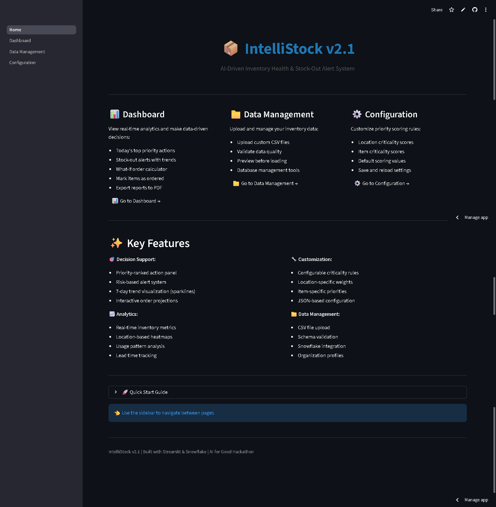
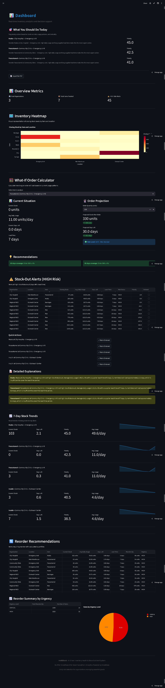

# 📦 IntelliStock - AI-Driven Inventory Management System

> **Hackathon:** Snowflake AI for Good 2024  
> **Version:** 2.1  
> **Status:** Production Ready ✅

## 🌐 Live Demo

**Try IntelliStock now:** [https://intellistock-ai-dashbaord-mvp.streamlit.app](https://intellistock-ai-dashbaord-mvp.streamlit.app)

---

IntelliStock is an intelligent inventory management platform designed for essential goods organizations (hospitals, NGOs, government agencies). It provides real-time stock-out predictions, priority-based action recommendations, and data-driven decision support powered by Snowflake.

---

## 🎯 Key Features

- **🎯 Smart Prioritization** - AI-driven priority scoring based on lead time, usage patterns, and criticality
- **📊 Real-time Analytics** - Interactive dashboards with trend visualization and predictive alerts
- **🧮 What-If Calculator** - Project inventory coverage based on planned orders
- **📄 PDF Export** - Download action items for offline sharing and team coordination
- **📁 CSV Upload** - Custom data upload with comprehensive schema validation
- **⚙️ Configurable Rules** - Customize location and item criticality scoring
- **☁️ Dual Configuration** - Works seamlessly in local development (.env) and cloud deployment (Streamlit secrets)

---

## 📸 Application Screenshots

### 🏠 Home Page

Clean landing page with feature overview and easy navigation.



### 📊 Dashboard

Real-time analytics with today's action panel, stock-out alerts, and interactive visualizations.



### 📁 Data Management

Upload CSV files, test Snowflake connections, and manage your inventory data.


### ⚙️ Configuration

Customize criticality scoring rules for locations and items.


---

## 🚀 Quick Start

### Prerequisites

- Python 3.8 or higher
- Snowflake account with credentials
- Git

### Installation

1. **Clone the repository:**

   ```bash
   git clone https://github.com/udaykumar0515/intellistock-ai-for-good.git
   cd intellistock-ai-for-good
   ```

2. **Create and activate virtual environment:**

   ```bash
   # Create venv
   python -m venv venv

   # Activate (Windows)
   venv\Scripts\activate

   # Activate (macOS/Linux)
   source venv/bin/activate
   ```

3. **Install dependencies:**

   ```bash
   pip install -r requirements.txt
   ```

4. **Configure Snowflake credentials:**

   **For Local Development:**

   - Copy `.env.example` to `.env`
   - Fill in your credentials:
     ```env
     SNOWFLAKE_ACCOUNT=your_account
     SNOWFLAKE_USER=your_username
     SNOWFLAKE_PASSWORD=your_password
     SNOWFLAKE_ROLE=your_role
     SNOWFLAKE_WAREHOUSE=your_warehouse
     SNOWFLAKE_DATABASE=your_database
     SNOWFLAKE_SCHEMA=your_schema
     ```

   **For Streamlit Cloud:**

   - The app automatically uses Streamlit secrets when `.env` is not found
   - Add the same variables to your Streamlit Cloud app secrets
   - No code changes needed!

5. **Run the application:**

   ```bash
   streamlit run Home.py
   ```

   The app will open at `http://localhost:8501`

---

## 📊 How It Works

### Priority Scoring Algorithm

IntelliStock uses a smart formula to rank items by urgency:

```
Priority Score = (Lead Time × 2) + (Daily Usage × 1.5) + Criticality - (Current Stock × 0.5)
```

**Components:**

- **Lead Time (×2)** - Longer supplier delivery times increase urgency
- **Daily Usage (×1.5)** - Higher consumption rates increase priority
- **Criticality** - Location/item importance (configurable 1-15)
- **Current Stock (×0.5)** - Lower stock levels increase urgency

**Example:**

```
Item: Paracetamol @ Emergency Unit
Lead Time: 10 days
Daily Usage: 20 units/day
Criticality: 10 (Emergency Unit) + 7 (Critical Medicine) = 10 (max)
Current Stock: 15 units

Priority = (10 × 2) + (20 × 1.5) + 10 - (15 × 0.5)
         = 20 + 30 + 10 - 7.5 = 52.5 (HIGH PRIORITY ⚠️)
```

---

## 📁 Data Requirements

### CSV Schema

Your inventory CSV should contain these columns:

| Column           | Type    | Description        | Example        |
| ---------------- | ------- | ------------------ | -------------- |
| `date`           | DATE    | Transaction date   | 2024-01-15     |
| `organization`   | STRING  | Organization name  | City Hospital  |
| `location`       | STRING  | Warehouse/clinic   | Emergency Unit |
| `item`           | STRING  | Product name       | Paracetamol    |
| `opening_stock`  | INTEGER | Stock at start     | 100            |
| `received`       | INTEGER | Units received     | 50             |
| `issued`         | INTEGER | Units distributed  | 30             |
| `closing_stock`  | INTEGER | Stock at end       | 120            |
| `lead_time_days` | INTEGER | Supplier lead time | 7              |

### Validation Rules

- ✅ All 9 columns required (case-insensitive)
- ✅ Dates in YYYY-MM-DD format
- ✅ Non-negative integers for stock values
- ⚠️ Formula check: closing = opening + received - issued

Sample data is included in `data/inventory_sample.csv`

---

## 🎓 First-Time Setup Guide

1. **Test Connection** - Go to Data Management → Test Snowflake Connection
2. **Initialize Database** - Click "Initialize Database" to create required tables
3. **Upload Data** - Upload your CSV file or load sample data
4. **View Dashboard** - Navigate to Dashboard to see analytics
5. **Configure Scoring** (Optional) - Adjust criticality rules in Configuration
6. **Export Reports** - Use PDF export to share action items with your team

---

---

## 🛠️ Tech Stack

- **Frontend:** Streamlit (Multi-page app)
- **Database:** Snowflake
- **Analytics:** Pandas, Plotly
- **PDF Export:** ReportLab
- **Configuration:** Python-dotenv

**Dependencies:**

```txt
streamlit>=1.28.0
snowflake-connector-python>=3.0.0
pandas>=2.0.0
plotly>=5.17.0
python-dotenv>=1.0.0
reportlab>=4.0.0
```

---

## 📦 Project Structure

```
intellistock-ai-for-good/
├── Home.py                      # Landing page
├── pages/
│   ├── 1__Dashboard.py          # Analytics & decision support
│   ├── 2__Data_Management.py    # CSV upload & database tools
│   └── 3__Configuration.py      # Criticality scoring editor
├── utils/
│   ├── calculations.py          # Business logic
│   └── csv_validator.py         # Data validation
├── data/
│   └── inventory_sample.csv     # Sample dataset
├── sql/
│   ├── create_tables.sql        # Database schema
│   └── analytics_queries.sql    # Core queries
├── screenshots/                 # App screenshots
├── snowflake_connector.py       # Database connection
├── criticality_config.json      # Scoring rules
├── requirements.txt             # Dependencies
├── .env.example                 # Environment template
└── README.md                    # This file
```

---

## 🔧 Configuration

### Criticality Scoring

Edit `criticality_config.json` or use the Configuration page:

```json
{
  "location_rules": [
    {
      "pattern": "Emergency Unit",
      "score": 10,
      "description": "Critical emergency care location"
    }
  ],
  "item_rules": [
    {
      "items": ["Paracetamol", "Insulin", "Syringes"],
      "score": 7,
      "description": "Critical medical supplies"
    }
  ],
  "default_score": 3
}
```

---

## 🆘 Troubleshooting

**"Module not found" errors:**

```bash
# Activate venv and reinstall
venv\Scripts\activate
pip install -r requirements.txt
```

**Snowflake connection fails:**

- Check `.env` credentials or Streamlit secrets
- Verify Snowflake account is active
- Test in: Data Management → Test Connection

**Data doesn't load:**

- Verify CSV schema matches requirements
- Check Snowflake query logs
- Reinitialize database if needed

---

## 📄 License

Open source - Available for use by humanitarian organizations worldwide.

---

## 👥 About

**Built for:** Snowflake AI for Good Hackathon 2024  
**Purpose:** Empowering essential goods organizations with intelligent inventory management
