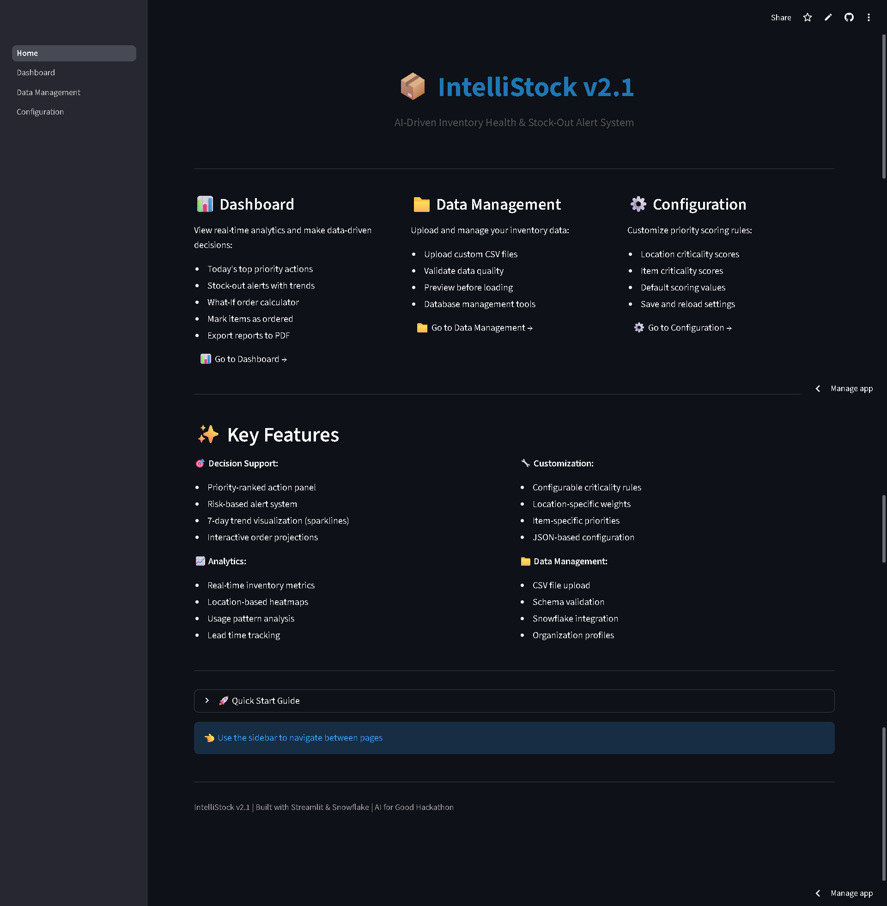
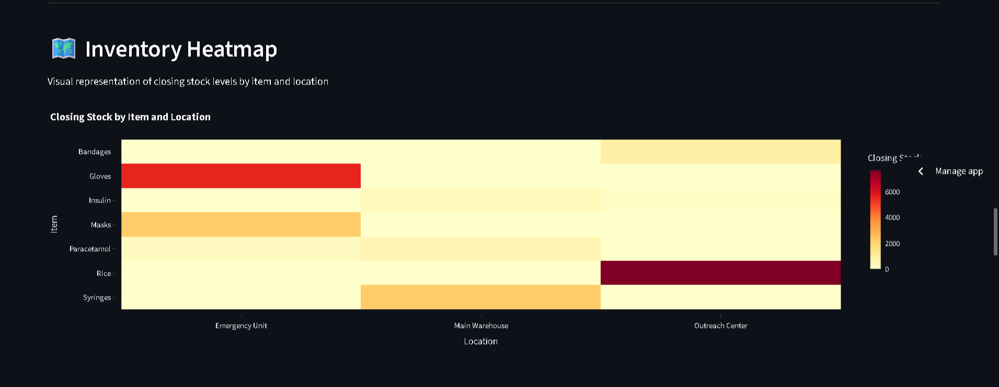
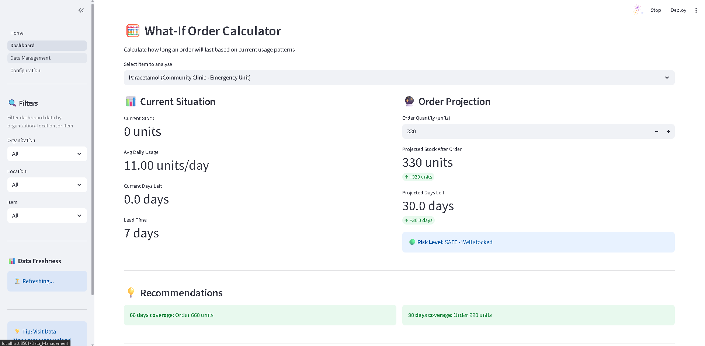

# IntelliStock

AI-driven inventory health system for essential goods organizations.

> Originally submitted to the **Snowflake AI for Good Hackathon 2025**
> 
> **Live Demo:** [https://intellistock-ai-dashbaord-mvp.streamlit.app/](https://intellistock-ai-dashbaord-mvp.streamlit.app/)



## Overview

IntelliStock helps hospitals, NGOs, and public distribution systems manage inventory more effectively. It provides real-time stock-out predictions, automated analytics, and data-driven decision support to reduce waste and prevent shortages of critical supplies.

## Features

- **Smart Prioritization** – AI-driven risk scoring identifies items requiring immediate attention
- **Visual Analytics** – Interactive heatmaps and trend visualizations by location and item
- **Decision Support** – What-If Order Calculator and automated reorder recommendations
- **Easy Export** – PDF reports for procurement teams

## Tech Stack

- **Frontend:** Streamlit (Python)
- **Backend:** Snowflake (data warehouse + compute)
- **Analytics:** Pandas, Plotly
- **Key Snowflake Features:** Dynamic Tables, Streams & Tasks, Snowpark SQL

## Quick Start

### Prerequisites

- Python 3.8+
- Snowflake account

### Installation

```bash
# Clone the repository
git clone https://github.com/udaykumar0515/intellistock-ai-for-good.git
cd intellistock-ai-for-good

# Create and activate virtual environment
python -m venv venv
venv\Scripts\activate  # Windows
# source venv/bin/activate  # macOS/Linux

# Install dependencies
pip install -r requirements.txt
```

### Configuration

Create a `.env` file (copy from `.env.example`):

```env
SNOWFLAKE_ACCOUNT=your_account
SNOWFLAKE_USER=your_username
SNOWFLAKE_PASSWORD=your_password
SNOWFLAKE_DATABASE=INTELLISTOCK_DB
SNOWFLAKE_SCHEMA=PUBLIC
SNOWFLAKE_WAREHOUSE=COMPUTE_WH
```

### Running the App

```bash
streamlit run Home.py
```

The app opens at `http://localhost:8501`

## Screenshots

**Dashboard with Heatmap**



**What-If Order Calculator**



## Data Format

Upload inventory data via CSV with these columns:

| Column | Type | Description |
|--------|------|-------------|
| `date` | DATE | Transaction date |
| `organization` | STRING | Organization name |
| `location` | STRING | Warehouse/facility |
| `item` | STRING | Product name |
| `opening_stock` | INTEGER | Stock at start of day |
| `received` | INTEGER | Units received |
| `issued` | INTEGER | Units distributed |
| `closing_stock` | INTEGER | Stock at end of day |
| `lead_time_days` | INTEGER | Supplier delivery time |

## Project Structure

```
intellistock-ai-for-good/
├── Home.py                    # Landing page
├── pages/
│   ├── 1__Dashboard.py        # Analytics dashboard
│   ├── 2__Data_Management.py  # CSV upload & tools
│   └── 3__Configuration.py    # Scoring configuration
├── utils/                     # Business logic
├── sql/                       # Snowflake DDL scripts
├── data/                      # Sample data
├── requirements.txt
└── README.md
```

## License

Open source – available for use by humanitarian organizations worldwide.

## Contact

- **GitHub Issues:** [Create an issue](https://github.com/udaykumar0515/intellistock-ai-for-good/issues)
- **Email:** udaykumarhaibathi@gmail.com

---

Built for the **Snowflake AI for Good Hackathon 2025**
